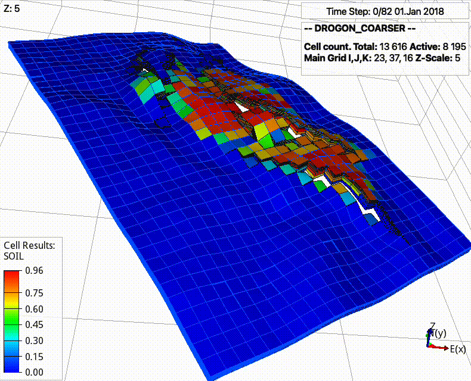

============
About pycopm
============

The **pycopm** tool for coarsening geological models is being funded by the `Center for Sustainable Subsurface Resources (CSSR) <https://cssr.no>`_ [project no. 331841].
This is work in progress.
Contributions are more than welcome using the fork and pull request approach.