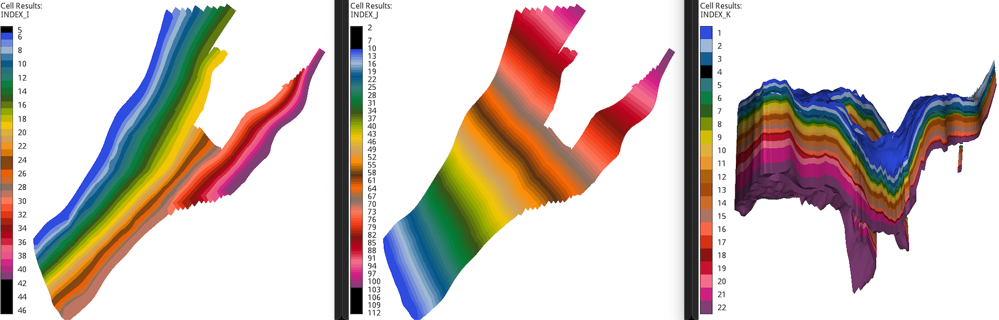

==================
Configuration file
==================
.. Note::
    The configuration files allow to set the integrated studies (coarsening and history matching)
    only for the drogon and norne model. To use **pycopm** in any given OPM Flow geological model
    to generate the coarser files, this can be achieve without a configuration file, but setting
    the parameters via command lines (see the :ref:`overview` or run `pycopm -h` for the definition 
    of the argument options, as well as the examples in :ref:`generic`.)

Here we use as an example one of the configuration files used in the tests
(see `ert.txt <https://github.com/crrs-tools/pycopm/blob/main/tests/configs/ert.txt>`_).
The first input parameter is:

.. code-block:: python
    :linenos:

    """Set the full path to the flow executable"""
    flow
    
If **flow** is not in your path, then write the full path to the executable
(e.g., /Users/dmar/Github/opm/build/opm-simulators/bin/flow).

The following input is:

.. code-block:: python
    :linenos:
    :lineno-start: 4

    """Delete files with this suffix to save storage"""
    '"EGRID","DBG","grdecl","UNRST","UNSMRY","PRT","inc","INFOSTEP","SMSPEC","INIT"'
                             
Here you write the type of files to delete after each realization is completed,
in order to save memory. 

.. note::
    The line number jumps from 2 in the definition of the flow path to 4. This since in
    the implementation white spaces between the different blocks are needed.

The next entries define the following parameters:

.. code-block:: python
    :linenos:
    :lineno-start: 7

    """Set the model parameters"""
    norne #Geological model (norne or drogon)
    ert #Type of study to run (single-run or ert)
    [0 2 1 2 2 0 2 0 2 0 2 0 2 2 0 2 0 2 2 0 2 1 2 2
    0 2 1 2 2 0 2 1 2 0 2 1 2 2 0 2 2 0 2 2 2 2 0] #Vector of x-coersing
    [0 2 1 2 2 0 2 1 2 2 0 2 1 2 2 0 2 1 2 2 0 2 1 2
    2 0 2 1 2 2 0 2 1 2 2 0 2 1 2 2 0 2 1 2 2 0 2 1
    2 2 0 2 1 2 2 0 2 1 2 2 0 2 1 2 0 2 1 2 2 0 2 1
    2 2 0 2 1 2 2 0 2 1 2 2 0 2 1 2 0 2 0 2 0 2 0 2
    0 2 0 2 0 2 0 2 2 2 2 2 2 2 2 2 0] #Vector of y-coersing
    [0 0 2 0 0 2 2 2 2 2 1 2 2 2 2 2 0 0 2 1 2 2 0 0 0 0 0 0 0 0 0 0] #Vector of z-coersing
    2 #Number of ensembles
    2 #Maximum number of ensembles running in parallel
    1 #Number of mpi processes to run flow
    600 #Maximum runtime in seconds of a realization. A value of 0 means unlimited runtime. 
    2 #Minimum number of realizations that must have succeeded for the simulation to be regarded as a success.
    7 #Set a specific seed for reproducibility. A value of 0 means no seed.  
    observations_training #Name of the observation file for the hm ('observations_training', 'observations_test', or 'observations_complete')
    0 #Select which coarser deck to use: 0 -> default one or 1 -> LET sat functions
    1 #For norne: for the LET coarser deck, select: 0 -> SATNUM=1, 1 -> SATNUM is computed from Sandve et al 2022, 2 -> #SATNUM=#Cells.  
    0 #0 -> no corrections for lost PV, 1 -> correct it on the cell boundaries, 2 -> account it on the porosity on all cells
    0 #Initialization 0 -> Equil 1->INIT from fine-scale
    0.1 0.1 0.1 #Error WWPR, WOPR, and WGPR
    100 100 100000 #Minimum error of WWPR, WOPR, and WGPR
    2005-03-01 #Last date to HM
    
.. warning::
    Do not remove # in each line (in the current implementation this is used for the reading of the parameters).

The single-run option results in Flow running only one simulation and the information shown in
the terminal is the one from the Flow executable instead of the ERT one. The ert option calls the ERT
executable and the command values are given after in the same input file which are discussed later.

The next three inputs define which pillars are removed (value 2) in the x, y, and z direction respectively. 

    I, J, and K cell index in the standard Norne data set.

Values of 0 or 1 do not remove the pilar.

.. tip::
    The 0 values are used to keep pillars in order to honor the main Norne shape. Then from the 
    example provided here, change the 2's for 1's to add back the pillars. 

The remaining lines define the number of ensembles, maximum number of ensembles running in parallel, the number of
processes used by flow if the mpirun option is available, the maximum runtime in seconds to stop a realization
(0 means unlimited time), the minimum number of realizations for the simulation to be regarded as a success,
the random seed for reproducibility (0 means no seed), the observation file for the hm 
('observations_training.data', 'observations_test.data', or 'observations_complete.data'), to use the saturation
functions from opm-tests norne or to use the LET saturation functions, defining if each of the coarser cells is
considered as only one region, regions as in Sandve et al 2022 or as a different SATNUM region, and the last entry
sets if the ntg and poro properties on the cells on the boundary are modified to account for lost PV respect to the
default simulation or if the porosity of all cells is modified to match this value. 

If the ert option is activated, then the following input:

.. code-block:: python
    :linenos:
    :lineno-start: 33

    """Set the command lines for the ert executable (gui, test_run, ensemble_experiment, ensemble_smoother, iterative_ensemble_smoother, and es_mda)"""
    """Command, value"""
    es_mda
    weights 1

sets the type of ert option and command flags. Currently, the options supported are gui, test_run, ensemble_experiment, ensemble_smoother, iterative_ensemble_smoother, and es_mda.
Confer to the `ERT <https://ert.readthedocs.io/en/latest/>`_ documentation for a full description of these options.

The Flow flags are defined in the next input:

.. code-block:: python
    :linenos:
    :lineno-start: 38

    """Set the flags for the flow executable"""
    """Parameter flag, value"""
    enable-opm-rst-file true
    newton-min-iterations 1

The LET saturation function parameters for each of the coarser cells are given in the following entry:

.. code-block:: python
    :linenos:
    :lineno-start: 43

    """Properties LET saturation functions"""
    """name, value, use dist in hm?, dist, distpara, distpara"""
    lw    3.  1 UNIFORM 1.1 5.
    ew    1.  1 UNIFORM -1. 2. 
    tw    3.  1 UNIFORM 1.1 5. 
    lo    3.  1 UNIFORM 1.1 5. 
    eo    1.  1 UNIFORM -1. 2. 
    to    3.  1 UNIFORM 1.1 5. 
    lg    3.  1 UNIFORM 1.1 5. 
    eg    1.  1 UNIFORM -1. 2. 
    tg    3.  1 UNIFORM 1.1 5. 
    log   3.  1 UNIFORM 1.1 5. 
    eog   1.  1 UNIFORM -1. 2. 
    tog   1.  1 UNIFORM 1.1 5. 
    lmlto 1.5 1 UNIFORM 1.  2. 
    emlto 1.  1 UNIFORM 0.9 2.1 
    tmlto 1.5 1 UNIFORM 1.  2. 
    lmltg 1.5 1 UNIFORM 1.  2. 
    emltg 1.  1 UNIFORM 0.9 2.1 
    tmltg 1.5 1 UNIFORM 1.  2.

The 'use dist?' defines if the property will be history match (1) or the provided value in the second entry will be used (0).

Finally, we set if the permeabilities will be considered for the hm: 

.. code-block:: python
    :linenos:
    :lineno-start: 64

    """Coarser rock properties"""
    """name, use dist in hm?, coarsing approach (max or mean)"""
    PERMX 1 max
    PERMY 0 max
    PERMZ 0 max

If option 1 is selected, then the distributions are UNIFORM with interval values of [perm_min, perm_max], corresponding to the
minimum and maximum values in each of the coarser cells. 
