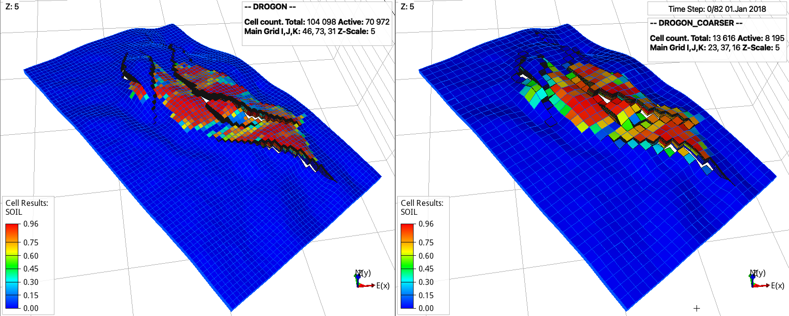
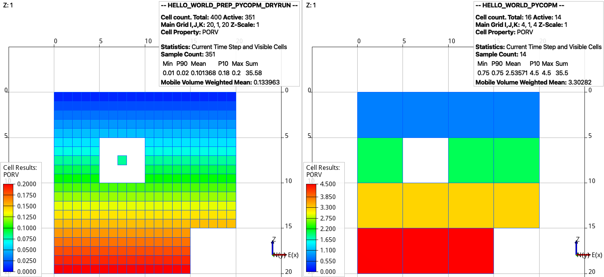
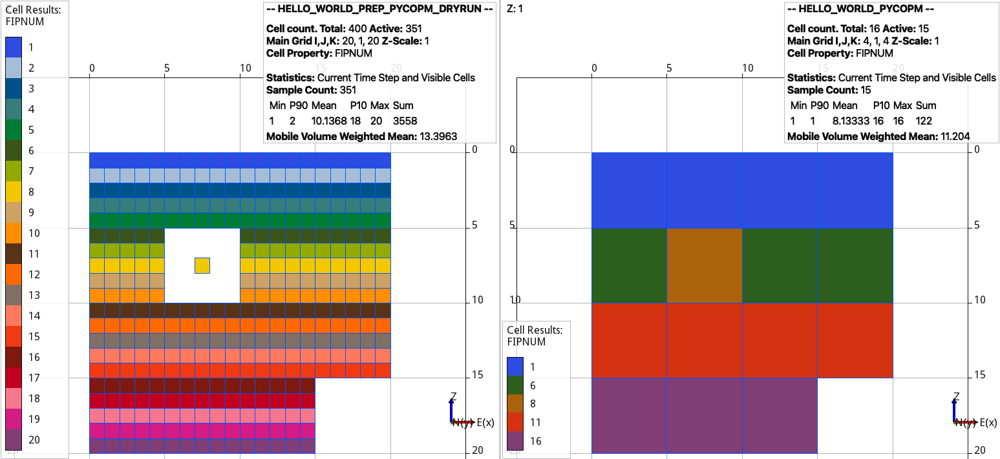
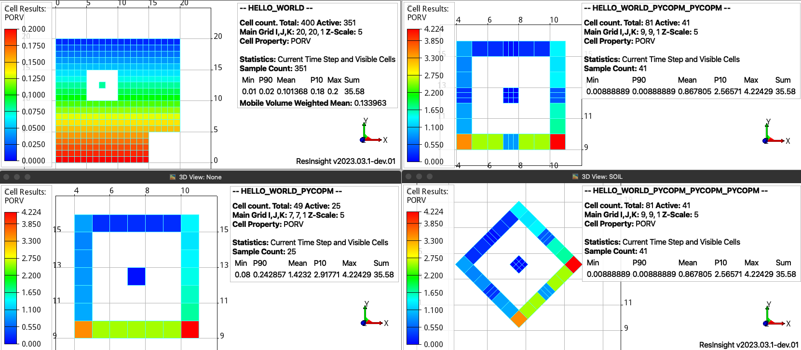
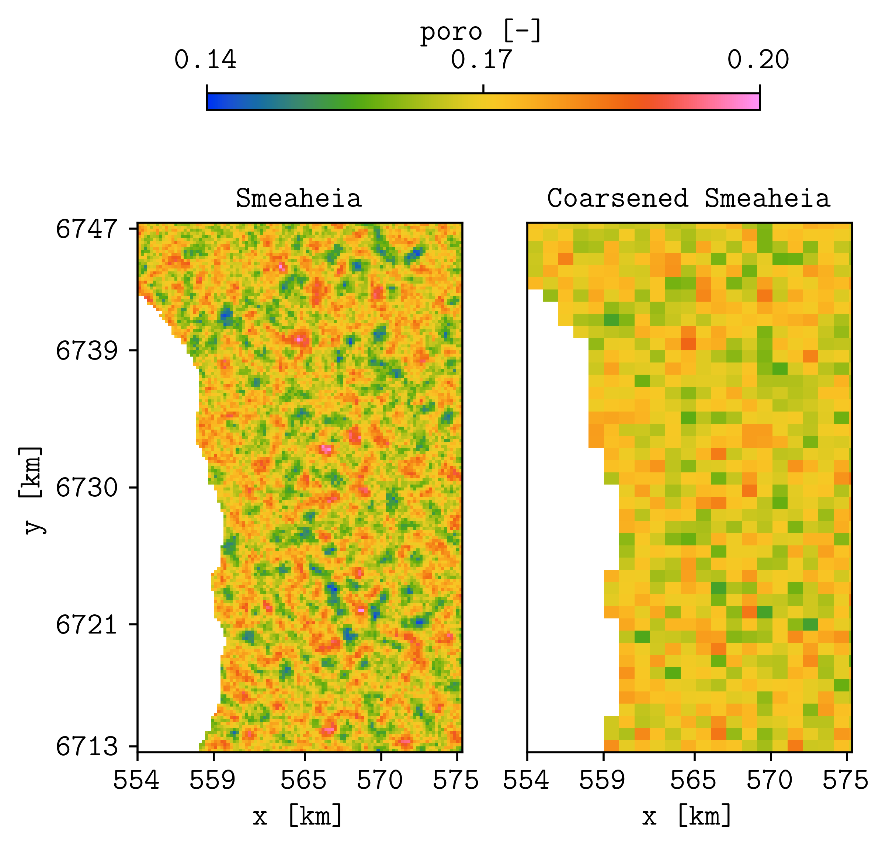
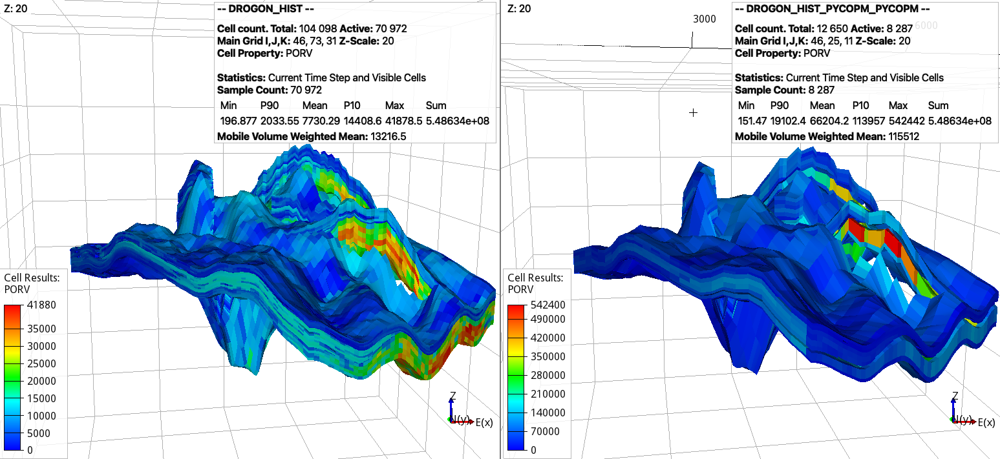
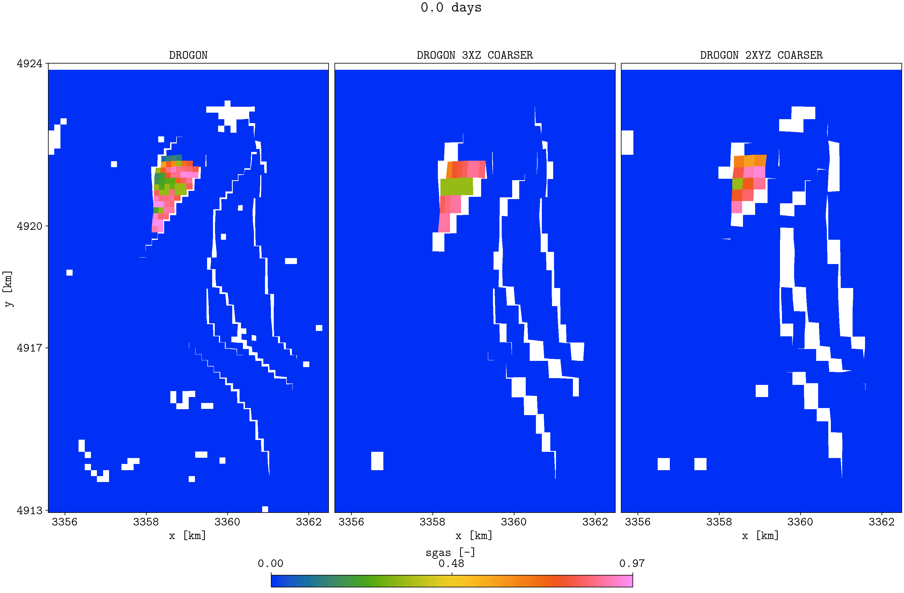
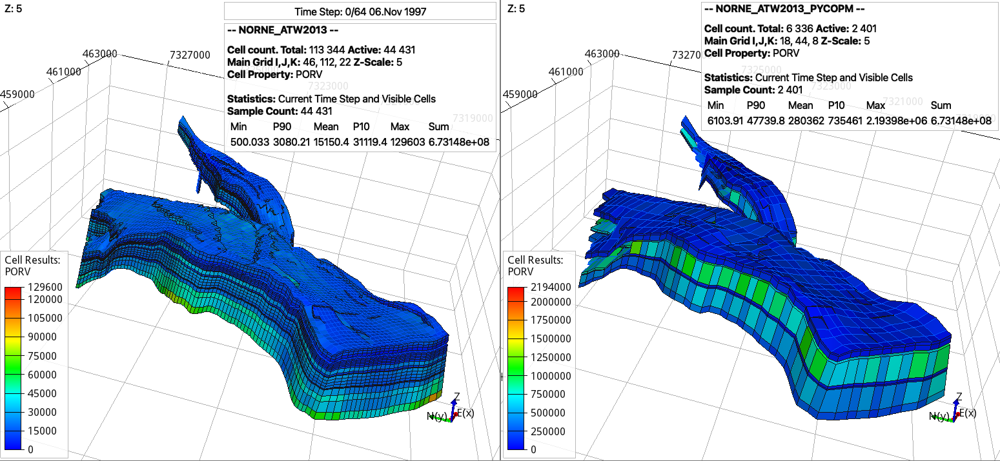
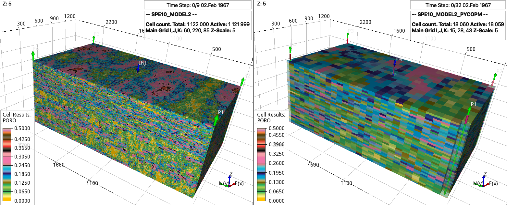
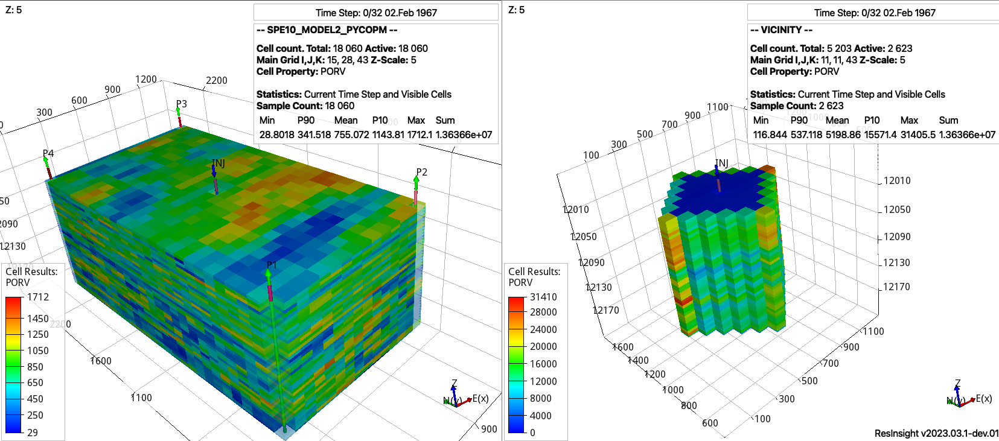

********
Examples
********

For additional examples demonstrating the applicability of **pycopm**, see the `tests <https://github.com/cssr-tools/pycopm/tree/main/tests>`_.
`ResInsight <https://resinsight.org>`_ and `plopm <https://github.com/cssr-tools/plopm>`_ are used for the visualization of the results.

.. note::

    For macOS users, you could try to install ResInsight following `this <https://github.com/SoilRos/homebrew-OPM>`_. If you have issues
    installing ResInsight, `ParaView <https://www.paraview.org>`_ can be also used. However, you need to add the flag **\-\-enable-vtk-output=true**
    to OPM Flow.

=======================
Via configuration files
=======================

The `examples <https://github.com/cssr-tools/pycopm/blob/main/examples/configurations>`_ folder contains configuration files
to perform HM studies in drogon and norne using `ERT <https://ert.readthedocs.io/en/latest/>`_. For example, by executing inside the `example folder for drogon <https://github.com/cssr-tools/pycopm/blob/main/examples/configurations/drogon>`_:

.. code-block:: bash

    # From inside the main pycopm folder
    cd examples/configurations/drogon
    pycopm -i input.toml -o drogon_coarser

The following are the drogon model from `opm-tests <https://github.com/OPM/opm-tests/tree/master/drogon>`_ and coarsened model generated using **pycopm**:

.. note::

    For Drogon, a scored is printed after the run to compared the error to the results available at 
    https://webviz-subsurface-example.azurewebsites.net/history-match. While `input.toml <https://github.com/cssr-tools/pycopm/blob/main/examples/configurations/drogon/input.toml>`_ 
    only runs a single simulation that is used in testing **pycopm**, `hm.toml <https://github.com/cssr-tools/pycopm/blob/main/examples/configurations/drogon/hm.toml>`_ runs a history matching 
    with a better score (i.e., less error compare to the observation data). This configuration file is also an example of how to use mpi to run Flow built from source 
    (set the flow path to your flow location; if you do not have mpi, you can remove it and still run the example).

.. _generic:

==================
Via OPM Flow decks 
==================

The current development of **pycopm** focuses on creating tailored models (grid refinement, grid coarsening, submodels, and transformations) by using input decks.
While in the Hello world example these four different options are demonstrated, for the latter examples the focus is on the grid coarsening functionality, and the
SPE10 also shows the submodel functionality. 

Hello world
-----------
For the `HELLO_WORLD.DATA <https://github.com/cssr-tools/pycopm/blob/main/examples/decks/HELLO_WORLD.DATA>`_ deck, by executing:

.. code-block:: bash

    # From inside the main pycopm folder
    cd examples/decks
    pycopm -i HELLO_WORLD.DATA -c 5,5,1 -m all -o output

.. note::

    If the folder to flow is not added to your path, then pass the full path to the flow executable using the flag **-f /path/to/flow**.

Using `ResInsight <https://resinsight.org>`_, then we can visualize the generated files in the output folder:

    Dry run from the input cloned deck (left) and (right) coarsened model. Adding the flag **-p 1** adds the remove pore volume to the neighbouring cells.

As mentioned above, if you do not have ResInsight, then to visualize the results in ParaView run

.. code-block:: bash

    flow HELLO_WORLD.DATA --enable-vtk-output=true
    flow HELLO_WORLD_PYCOPM.DATA --enable-vtk-output=true

To make active the coarsened cell where there is only one active cell, this can be achieved by:

.. code-block:: bash

    pycopm -i HELLO_WORLD.DATA -c 5,5,1 -m all -a max

    Dry run from the input cloned deck (left) and (right) coarsened model. The region numbers by default are given by the mode, e.g., use the flag **-n max** to keep the maximum integer.

As described in the :doc:`theory <./theory>`, **pycopm** can be not only used for grid coarsening, but also to apply grid refinements, submodels, and transformations.
Then, with the following commands first we substract a submodel around the isolated grid cell proyecting the outside pore volume on the boundaries, after 
we apply a grid refinement on the cells in the middle x and y location, and finally we rotate the model 45 degrees.

.. code-block:: bash

    pycopm -i HELLO_WORLD.DATA -v 'xypolygon [4,8.5] [4,16.5] [11.5,16.5] [11.5,8.5]' -p 1 -m all
    pycopm -i HELLO_WORLD_PYCOPM.DATA -rx 0,0,0,2,0,0,0 -ry 0,0,0,2,0,0,0 -m all
    pycopm -i HELLO_WORLD_PYCOPM_PYCOPM.DATA -d 'rotatexy 45' -m all

    Extracted region with the projected pore volumes (bottom left), refinement around the center cells (top right), and rotation (bottom right).
    The text in the legends highlight that the pore volume is conserved (35.58) and the number of active cells is reduced from 351 to 25 in the 
    submodel and after increased to 41 due to the grid refinement.

.. note::

    To write the cell values for the SOLUTION section instead of using the EQUIL keyword, this can be achieved by the flag **-explicit 1**; the 
    only requirement is that the EQUIL keyword needs to be in the main input DATA file and no via INCLUDE files.

Smeaheia
--------

By downloading the `Smeaheia simulation model <https://co2datashare.org/dataset/smeaheia-dataset>`_ (dataset part Simulation models),
then:

.. code-block:: bash

    # From the download folders
    cd Simulation_Models/data
    pycopm -c 5,4,3 -a min -m all -i Statoil_Feasibility_sim_model_with_depletion_KROSS_INJ_SECTOR_20.DATA -o .

will generate a coarser model five times in the x direction, four in the y direction, and three in the z direction, where the coarse cell is
made inactive if at least one cell is inactive (**-a min**).

We use our `plopm <https://github.com/cssr-tools/plopm>`_ friend to generate PNG figures:

.. tip::
    You can install `plopm <https://github.com/cssr-tools/plopm>`_ by executing in the terminal:
    
    .. code-block:: bash
        
        pip install git+https://github.com/cssr-tools/plopm.git

.. code-block:: bash

    plopm -i 'STATOIL_FEASIBILITY_SIM_MODEL_WITH_DEPLETION_KROSS_INJ_SECTOR_20_PREP_PYCOPM_DRYRUN STATOIL_FEASIBILITY_SIM_MODEL_WITH_DEPLETION_KROSS_INJ_SECTOR_20_PYCOPM' -s ,,0 -v poro -subfigs 1,2 -save smeaheia -t 'Smeaheia  Coarsened Smeaheia' -delax 1 -xunits km -xformat .0f -yunits km -yformat .0f -d 5,4.5 -suptitle 0 -c cet_rainbow_bgyrm_35_85_c69 -cbsfax 0.2,0.95,0.6,0.02 -cformat .2f

    Top view of porosity values for the (left) original and (right) coarsened model (note that we also apply the coarsening on the z direction).

.. _drogon:

Drogon
------

.. note::
    In the current implementation of the **pycopm** tool, the handling of properties that requires definitions of i,j,k indices 
    (e.g., FAULTS, WELLSPECS) are assumed to be defined in the main .DATA deck. Then, in order to use **pycopm** for simulation models 
    where these properties are define via include files, replace those includes in the .DATA deck with the actual content of the include files.
    Here are some relevant keywords per deck section that need to be in the main input deck and not via include files:

    SECTION GRID: MAPAXES, FAULTS, MULTREGT (other keywords like MULTZ, NTG, or definitions/operations for perms and poro can be in included files since 
    permx, permy, permz, poro, porv, multx, multy, multz are read from the .INIT file)

    SECTION PROPS: EQUALS, COPY, ADD, and MULTIPLY since this involve i,j,k indices and are applied to properties such as saturation functions parameters that
    are still given in the same input format in the generated deck. In addition, SWATINIT if used in the deck, is read from the .INIT file and output for the 
    modified deck in a new file, then one might need to give the right include path to this special case. 

    SECTION SCHEDULE: All keywords in this section must be in the input deck and no via include viles.

Following the note above, then by downloading the `DROGON model <https://github.com/OPM/opm-tests/tree/master/drogon>`_, adding the `MAPAXES <https://raw.githubusercontent.com/OPM/opm-tests/master/drogon/include/grid/drogon.grid>`_ 
to the deck, replacing the lines in `DROGON_HIST.DATA <https://github.com/OPM/opm-tests/blob/master/drogon/model/DROGON_HIST.DATA>`_ for the FAULTS (L127-128) and SCHEDULE (L242-243) with the actual content of those include files, then by executing:

.. code-block:: bash

    pycopm -i DROGON_HIST.DATA -c 1,1,3 -p 1 -q 1 -l C1
    pycopm -i DROGON_HIST_PYCOPM.DATA -c 1,3,1 -p 1 -q 1 -j 2.5 -l C2 -m all

this would generate the following coarsened model:

    Note that the total pore volume is conserved for the coarsened model (right). The properties of the standard model (left) can be visualized using the DROGON_HIST_PREP_PYCOPM_DRYRUN generated files.

Here, we first coarse in the z direction, which reduces the number of cells from 31 to 11, and after we coarse in the y direction.
After trial and error, the jump (**-j**) is set to 2.5 to avoid generated connections across the faults. For geological models with a lot of
inactive cells and faults, this divide and conquer apporach is recommended, i.e., coarsening first in the z direction and after coarsening
in the x and y directions. Also, we add labels (**-l**) C1 and C2 to differentiate between the coarse include files. In addition, we use the 
flags **-p 1 -q 1** to add the remove pore volume to the closest coarser cells and to redistribute the pore volume in the locations with 
gas and oil, this results in the coarsened model having the same total pore volume, field gas in place, and practically same oil and water in 
place as the input model.

.. note::
    Add to the generated deck the removed include files in the grid section related to the region operations (e.g.,
    ../include/grid/drogon.multregt for this case).

Now, we also show a two times coarsened model in all directions (referring to the previous comment about divide and conquer, for the Drogon model
it seems still ok to do a two times coarsening in one go):

.. code-block:: bash

    pycopm -i DROGON_HIST.DATA -c 2,2,2 -p 1 -q 1 -j 4 -w DROGON_2TIMES_COARSER -m all

Here, we use the **-w** flag to give a specific name to the generated coarsened deck, as well as using a higher value of **-j** to avoid generated connections across the faults.

.. tip::
    To use a different approach from the default ones (see the :doc:`theory <./theory>`) to coarse one of the properties (e.g., permeabilities), this can 
    be achieve by the **-s** flag, e.g., **-s pvmean** to coarse the permeabilities using a pv-weighted mean. In addition, one could add a different label 
    **-l pvweightedperms** to identify the generated .INC files with the permeabilities, and rename these files in order to be used in the coarserned model with the rest 
    of the properties using the default aproaches or a combination of them (e.g., **-s max -l maxpermz** and keep the maximum values of permz).

If we run these three models using OPM Flow:

.. code-block:: bash

    flow DROGON_HIST.DATA
    flow DROGON_HIST_PYCOPM_PYCOPM
    flow DROGON_2TIMES_COARSER

then we can compare the summary vectors. To this end, we use our good old friend `plopm <https://github.com/cssr-tools/plopm>`_:

.. code-block:: bash

    plopm -i 'DROGON_HIST DROGON_HIST_PYCOPM_PYCOPM DROGON_2TIMES_COARSER' -v 'FOIP,FOPR,TCPU' -tunits y -f 14 -subfigs 2,2 -delax 1 -loc empty,empty,empty,center -d 10,5 -xformat '.1f' -xlnum 6 -ylabel 'sm$^3$  sm$^3$/day  seconds' -t 'Field oil in place  Field oil production rate  Simulation time' -labels 'DROGON  DROGON 3XZ COARSER  DROGON 2XYZ COARSER' -save drogon_pycopm_comparison -yformat '.2e,.0f,.0f'

.. figure:: figs/drogon_pycopm_comparison.png

    Note that the coarsened models have the same initial field oil in place as the input model. It seems the coarsened properties (e.g., permeabilities)
    are good initial inputs to use in a history matching framework (e.g., to history match saturation function parameters), and the lower simulation 
    time for the coarsened models allow for more ensemble members and more iterations.

We can also make a nice GIF by executing:

.. code-block:: bash

    plopm -v sgas -subfigs 1,3 -i 'DROGON_HIST DROGON_HIST_PYCOPM_PYCOPM DROGON_2TIMES_COARSER' -d 16,10.5 -m gif -dpi 300 -t "DROGON  DROGON 3XZ COARSER  DROGON 2XYZ COARSER" -f 16 -interval 2000 -loop 1 -cformat .2f -cbsfax 0.30,0.01,0.4,0.02 -s ,,1 -rotate -30 -xunits km -yunits km -xformat .0f -yformat .0f -c cet_rainbow_bgyrm_35_85_c69 -delax 1 -r 0:3

    Top view of the Drogon and the two coarsened models

Norne
-----
By downloading the `Norne model <https://github.com/OPM/opm-tests/tree/master/norne>`_ (and replacing the needed include files as described in the previous
example, specially the include file `./INCLUDE/BC0407_HIST01122006.SCH <https://github.com/OPM/opm-tests/blob/master/norne/INCLUDE/BC0407_HIST01122006.SCH>`_ at the end of `NORNE_ATW2013.DATA <https://github.com/OPM/opm-tests/blob/master/norne/NORNE_ATW2013.DATA>`_ to run the example without errors),
then here we create a coarsened model by removing certain pilars in order to keep the main features of the geological model:

.. code-block:: bash

    pycopm -i NORNE_ATW2013.DATA -s pvmean -x 0,2,0,2,2,0,2,0,2,0,2,0,2,2,0,2,0,2,2,0,2,0,2,2,0,2,0,2,2,0,2,0,2,0,2,0,2,2,0,2,2,0,2,2,2,2,0 -y 0,2,0,2,2,0,2,0,2,2,0,2,0,2,2,0,2,0,2,2,0,2,0,2,2,0,2,0,2,2,0,2,0,2,2,0,2,0,2,2,0,2,0,2,2,0,2,0,2,2,0,2,0,2,2,0,2,0,2,2,0,2,0,2,0,2,0,2,2,0,2,0,2,2,0,2,0,2,2,0,2,0,2,2,0,2,0,2,0,2,0,2,0,2,0,2,0,2,0,2,0,2,0,2,2,2,2,2,2,2,2,2,0 -z 0,0,2,0,0,2,2,2,2,2,0,2,2,2,2,2,0,0,2,0,2,2,0 -a min -p 1 -q 1 -m all

this would generate the following coarsened model:

.. _spe10:

SPE10
-----

By downloading the `SPE10_MODEL2 model <https://github.com/OPM/opm-data/tree/master/spe10model2>`_, then:

.. code-block:: bash

    pycopm -i SPE10_MODEL2.DATA -s pvmean -c 4,8,2 -m all

generates a coarsened model from ca. 1 million cells to ca. 20 thousands cells.

    Porosity values for the (left) original and (right) coarsed SPE10 model.

To generate a submodel from the coarsened model around the injector 'INJ', this can be achieved by executing:

.. code-block:: bash

    pycopm -i SPE10_MODEL2_PYCOPM.DATA -p 1 -v 'INJ diamondxy 5' -m all -w vicinity -l sub -m all

    Pore volume values for the (left) coarsened and (right) vicinity around the well INJ in the SPE10 model.

==================
Graphical abstract 
==================

Here we describe how to generate the geological model ilustrations in the `graphical abstract <https://github.com/cssr-tools/pycopm/blob/main/docs/text/figs/pycopm.png>`_.
These five ilustrations are generated from the `DROGON_HIST.DATA <https://github.com/OPM/opm-tests/blob/master/drogon/model/DROGON_HIST.DATA>`_ model, and the
visualization is achieve using `ResInsight <https://resinsight.org>`_.  

* Top figure: By running the `DROGON_HIST.DATA <https://github.com/OPM/opm-tests/blob/master/drogon/model/DROGON_HIST.DATA>`_ using opm flow and visaluazing the static property pore volume.
* Coarsenings: This corresponds to the generated DROGON_HIST_PYCOPM_PYCOPM.DATA deck in :ref:`drogon`.
* Submodels: pycopm -i DROGON_HIST.DATA -v 'xypolygon [463739,5931508] [464872,5932123] [464401,5932862] [463284,5932209] [463739,5931508]' -w SUBMODELS -m all
* Refinements: pycopm -i SUBMODELS.DATA -g 2,2,2 -w REFINEMENTS -m all
* Transformations: pycopm -i DROGON_HIST.DATA -d 'rotatexy 45' -w TRANSFORMATIONS -m all

Note that for ResInsight to show the wells, one needs to run the decks (e.g., flow REFINEMENTS.DATA).
