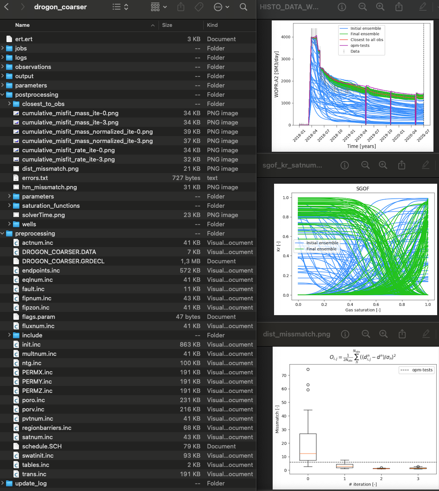
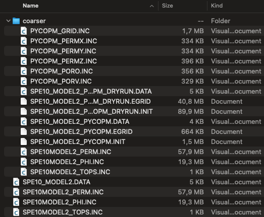

=============
Output folder
=============

Via configuration files 
-----------------------
As described in the :doc:`introduction <./introduction>`, in the early development of **pycopm** 
the focus was on history matching studies using `ERT <https://ert.readthedocs.io/en/latest/>`_ for the 
`norne <https://github.com/OPM/opm-tests/tree/master/norne>`_  and `drogon <https://github.com/OPM/opm-tests/tree/master/drogon>`_ geological models
via a :doc:`configuration file <./configuration_file>`.

The following screenshot shows the generated ERT configuration file and folders in the selected output folder after executing **pycopm**
on the drogon model.

    (Left) example of generated files after executing **pycopm** and (right) some of the figures in the postprocessing folder.

The generate ert.ert file can be run directly calling ERT for further studies, and some useful plots and files
are generated in the postprocessing folder. The OPM simulation results can be visualized using `ResInsight <https://resinsight.org>`_.

Via an OPM Flow input deck
--------------------------
The current development of **pycopm** focuses on creating modified models, i.e., all needed input files to run OPM Flow, by using the input deck and 
defining the approach (grid refinement, grid coarsening, submodels, and transformations including scalings, rotations, and translations).

The following screenshot shows the input deck and generated files in the selected output folder (coarser for this example) after executing **pycopm** on the :ref:`generic`

Then, after running **pycopm**, one could adapt the generated files of the modified geological model in your
favourite history matching/optimization tool (e.g., `ERT <https://ert.readthedocs.io/en/latest/>`_, `PET <https://python-ensemble-toolbox.github.io/PET/>`_), or use the model in your own application.

.. Note::
    For input decks that include other files without giving the full path (e.g., './include/summary...'), then we recommend
    to use the default output folder (-o .), i.e., the modified deck and files would be generated in the same location as
    the input deck and no errors would appear for not finding the include files; otherwise, you might need to copy all needed folders
    with the include files to the output folder, or set the correct path to the include files in the generated deck. 